# AI-NovelFlow 影视智能创作平台 — UML 图集

> 全部图形使用 Mermaid 语法（v10+），可在 VS Code（Markdown Preview Mermaid Support）、Typora、GitHub 中直接渲染。
> 本文档是 `00_软件开发文档.md` 的完整展开版。v1.0 为 H3 集成图集（第 1-7 章），v2.0 追加三大工作流架构图（第 8 章）。

---

## 目录

1. [用例图](#1-用例图)
2. [类图](#2-类图)
3. [时序图](#3-时序图)
4. [活动图](#4-活动图)
5. [组件图](#5-组件图)
6. [部署图](#6-部署图)
7. [ER 图（数据模型）](#7-er-图数据模型)

---

## 1. 用例图

> Mermaid 暂无原生 use case 语法，用 flowchart 表达参与者（actor）与用例关系。

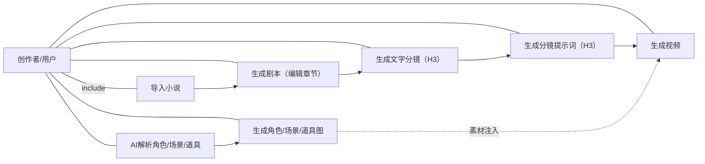

**用例说明**：

| 用例 | 主路径 | 前置 | 系统交互 |
|---|---|---|---|
| 生成文字分镜（H3） | 点击「H3 生成文字分镜」→ 确认 → 等待生成 | 章节有内容、LLM 已配置 | POST `/h3-split` → 清旧分镜 → 落库 Shot → 返回分镜列表 |
| 生成分镜提示词（H3） | 点击「生成分镜提示词（H3）」→ 确认 | 已生成 H3 分镜 | POST `/h3-prompt-all` → 逐镜生成 → 写入 video_description → 刷新列表 |
| 生成视频 | 视频生成 Tab 执行 | 分镜有 H3 提示词、ComfyUI 运行 | 复用原有 video workflow（H3 格式） |

---

## 2. 类图

### 2.1 后端核心类

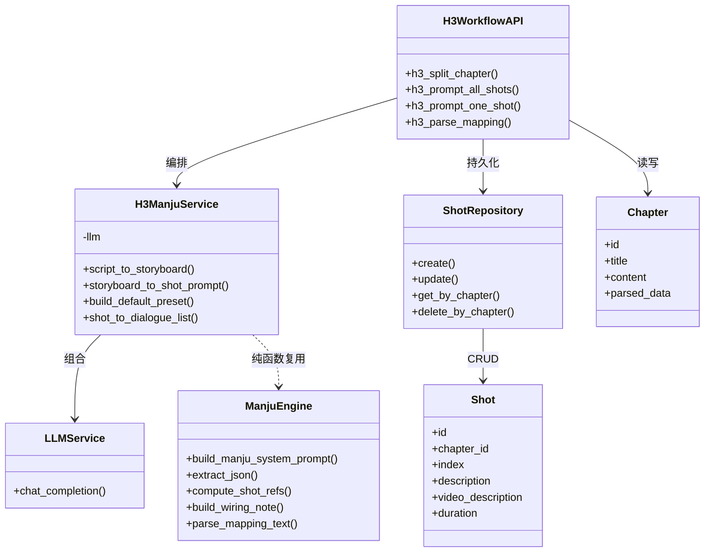

### 2.2 前端核心类型（Zustand store 切片）

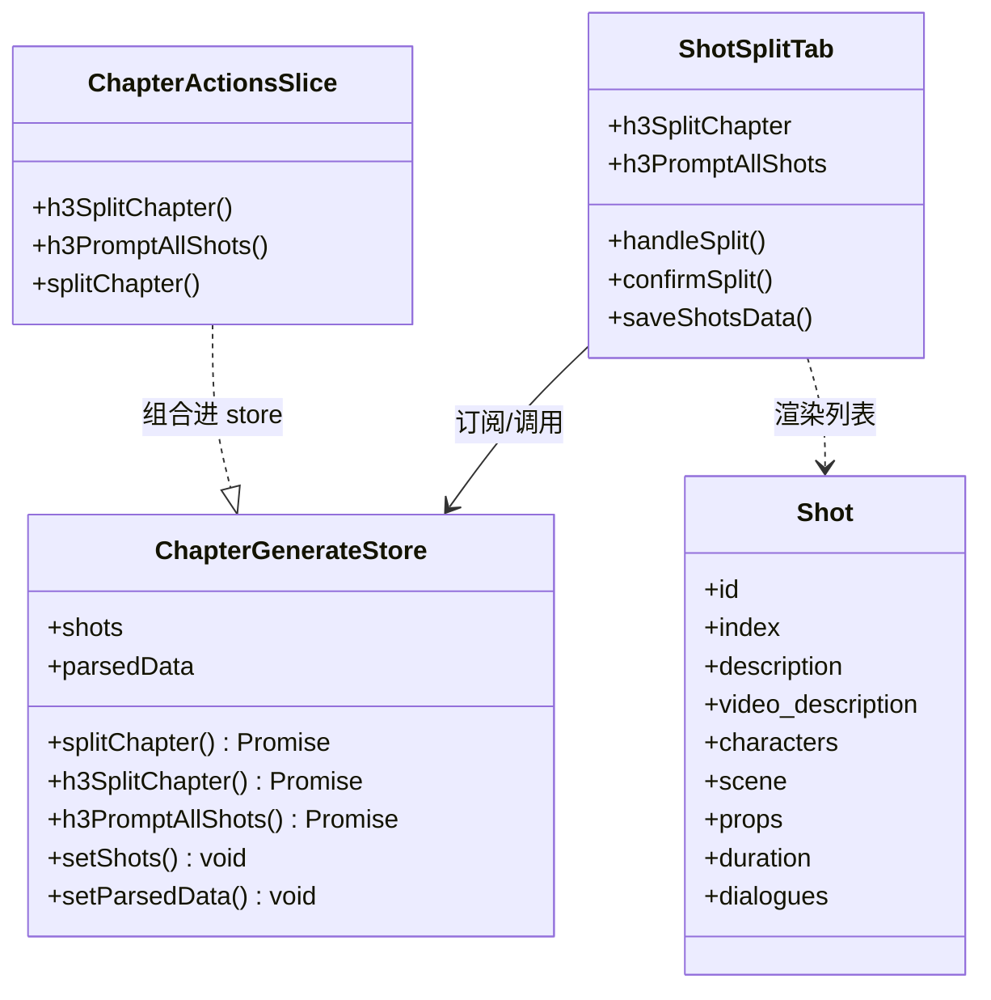

---

## 3. 时序图

### 3.1 剧本 → 文字分镜（h3-split）

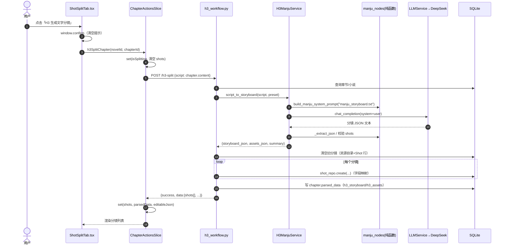

### 3.2 分镜 → 逐镜 H3 提示词（h3-prompt-all）

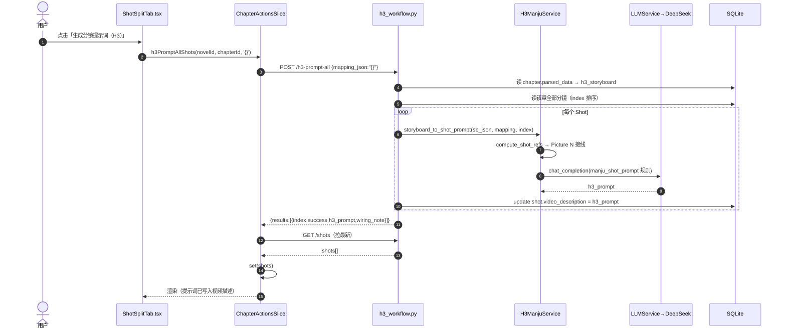

### 3.3 资源映射解析（h3-mapping）

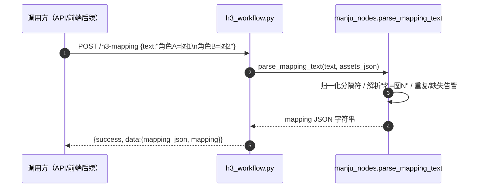

---

## 4. 活动图

### 4.1 章节生成主流程（含并行区间）

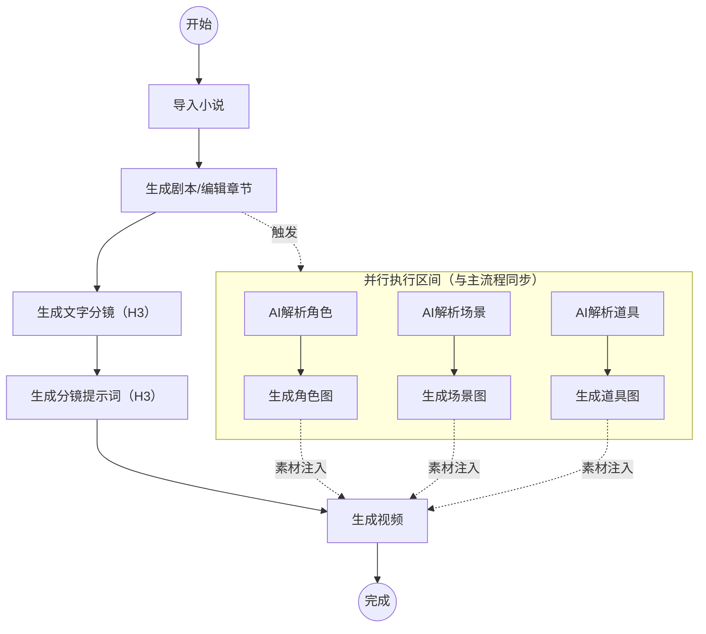

### 4.2 h3-split 内部活动（后端）

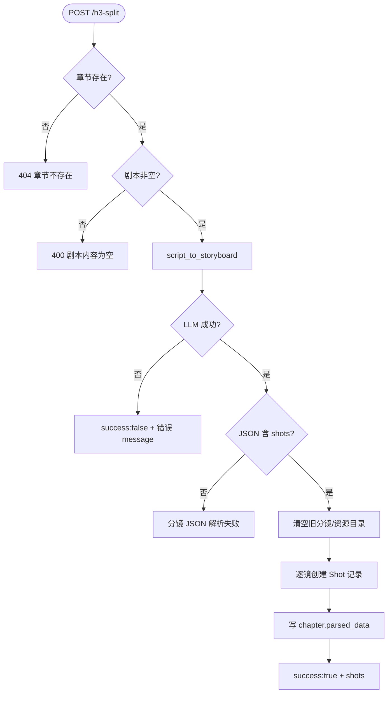

### 4.3 用户操作决策（前端）

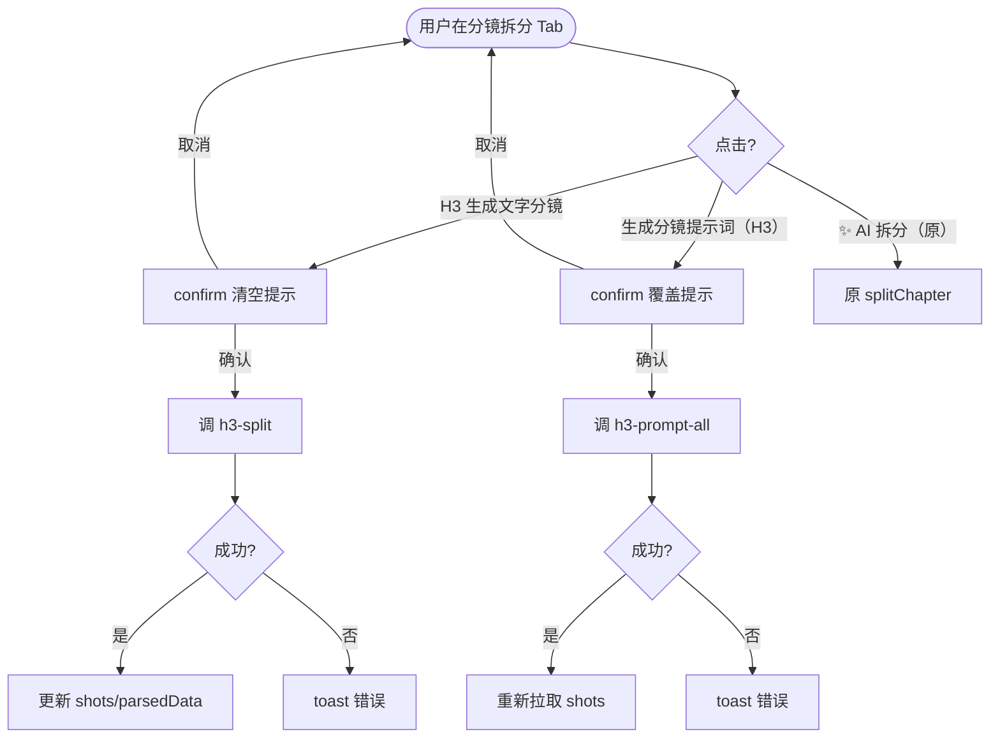

---

## 5. 组件图

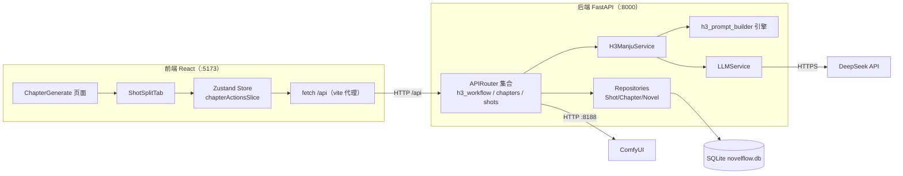

---

## 6. 部署图

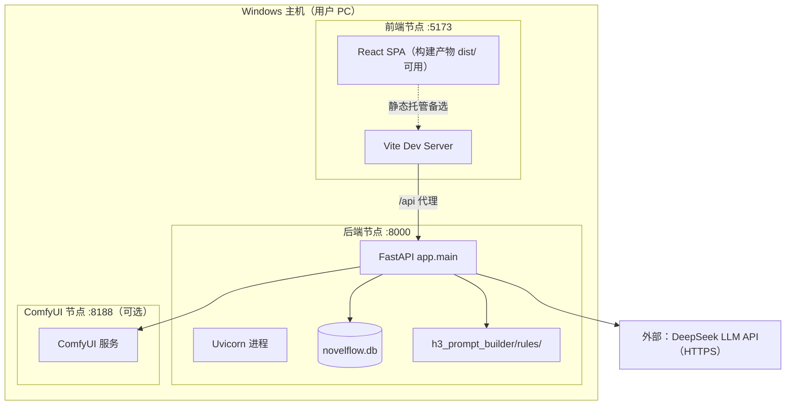

**部署要点**：
- 后端依赖：Python 3.12 + requirements.txt（fastapi/sqlalchemy/uvicorn 等）
- 前端依赖：node_modules（已随备份复制）；`npm run dev` 开发、`npm run build` 出 dist
- 数据库：SQLite 单文件 `novelflow.db`，随项目复制，无需安装
- 外部：DeepSeek API（需 api_key）；ComfyUI 仅出图/视频需要

---

## 7. ER 图（数据模型）

> 仅展示与 H3 链路相关的核心实体与关系；其余表（tasks/workflows/prompt_templates 等）省略。

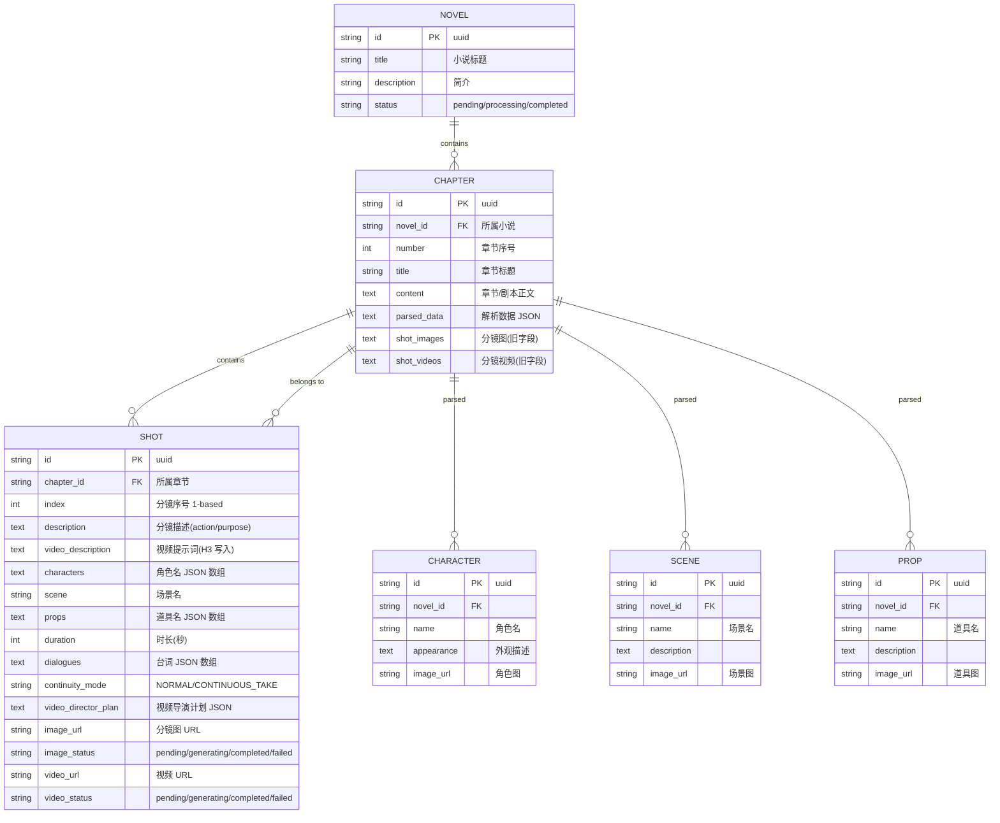

**H3 相关存储约定**：
- `chapters.parsed_data` 增补键：`h3_storyboard`（完整分镜 JSON）、`h3_assets`（角色/场景/道具清单）
- `shots.video_description`：H3 提示词最终写入位置（视频生成 Tab 的输入）
- 不新增表、不新增列 → 无数据库迁移

---

## 附：渲染提示

- VS Code：安装扩展 "Markdown Preview Mermaid Support" 或 "Markdown Preview Enhanced"
- Typora：内置 Mermaid 支持
- GitHub：仓库内直接渲染 .md 的 Mermaid
- 若编辑器不支持 Mermaid，可复制代码块到 https://mermaid.live 在线渲染

---

## 8. 三大工作流架构图（v2.0 追加）

### 8.1 平台系统架构（含三工作流）

```mermaid
flowchart TB
    subgraph Browser["浏览器 React :5173"]
        W["欢迎页 / 小说管理 / 章节生成页"]
        M["武术指导 /martial-arts"]
        V["视频资源替换 /video-asset-swap"]
        MON["任务进程监控 /monitor"]
    end

    subgraph BE["AI-NovelFlow 后端 FastAPI :8000"]
        H3["h3_workflow 路由<br/>H3ManjuService + h3_prompt_builder 规则库"]
        MA["martial_arts 路由<br/>video_director_ai（锚定卡/16宫格/生图编排）"]
        VA["video_asset 路由<br/>VideoAssetHistory 模型"]
        GS["gpu_scheduler（GPU 串行调度）"]
        TASK["任务系统 / 监控聚合"]
    end

    subgraph Ext["外部本地服务"]
        OLL["Ollama :11434<br/>qwen3:8b / 30b-a3b / qwen2.5vl"]
        CUI["ComfyUI :8188<br/>Flux2-4B 生图 / MiniMax H3 生视频"]
        PIPE["ManjuToSplitFrameAndProperty<br/>视频解析管线（独立 venv 子进程）"]
    end

    DB[("SQLite novelflow.db")]

    W --> BE
    M --> BE
    V --> BE
    MON --> BE
    H3 --> OLL
    MA --> OLL
    MA --> CUI
    VA --> PIPE
    VA --> DB
    H3 --> DB
    MA --> DB
    GS -.全局锁.-> H3
    GS -.全局锁.-> MA
    PIPE -.产物JSON只读.-> VA
